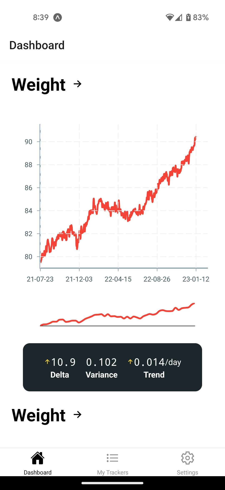
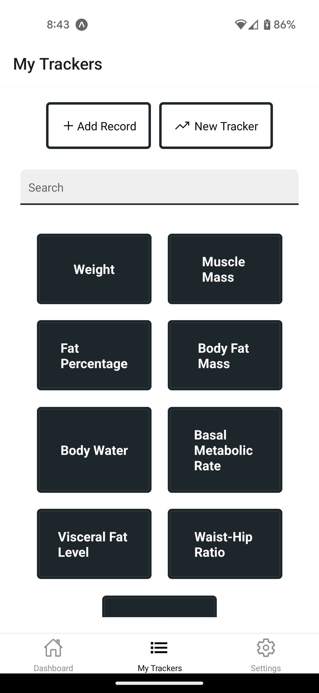
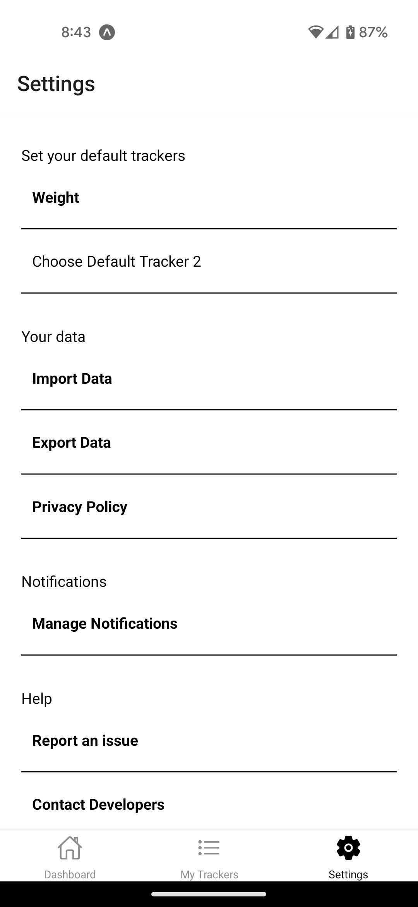
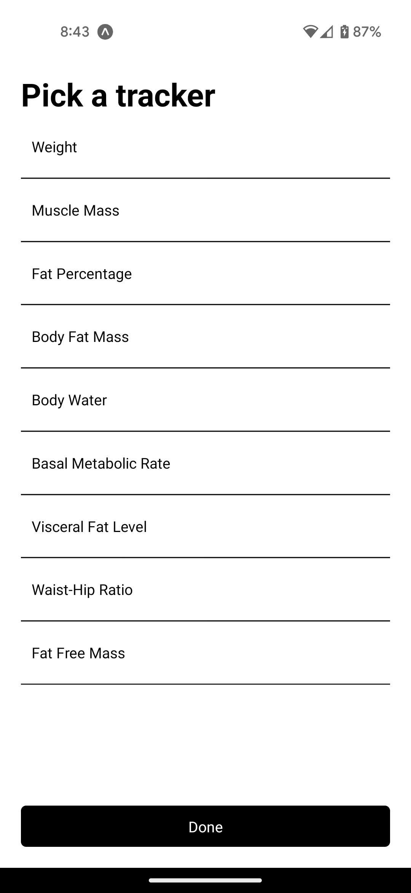
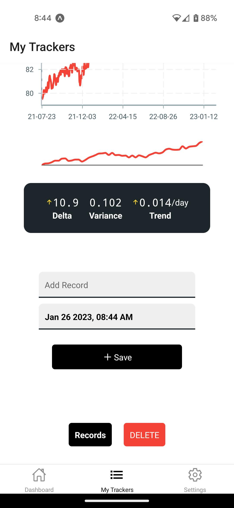

# TRAK
A React Native app to record and visualize progress.

- Create "trackers" to enter data points regularly
- Add reminders to remind you to add records every day
- See a graphical visualization of your progress

